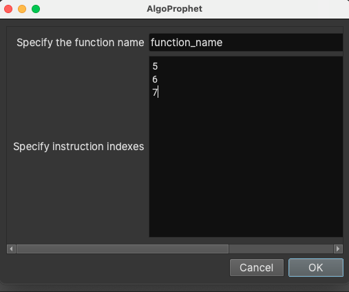
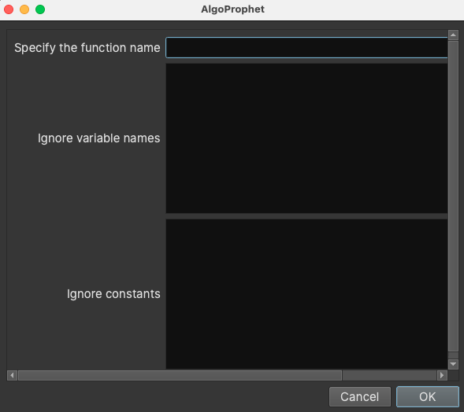

# AlgoProphet
Author: Rafael

Work in progress :construction_worker_man:

## Description

## Usage
1. Add formula of algorithm into `formula.json`.  
```json
{
    ...existing...,
    "xxx.gml": "rendered form of algorithm",
}
```
2. If you want to ignore matched instructions in some functions, just add them to `ignore.txt`.

### Build model on your own

Models can be found in `./test` of plugin folder. We also visualize the models in the folder so that users can clearly understand it. Users can also move on to adjust the model(described in next section) based on the visualization results.  

> here comes a hint for generating good model: keep it as simple as possible

### Adjust model

It is hard to build model perfectly at the first time, so we build up an interactive window for users to decide what nodes they want to remove from their models.

### If you are satisfied with your model
Then move it into `./models` of plugin folder. After moving it, remember to do the step 1 mentioned in `Usage`.

> Suggest to keep test folder clean after you move your own model

## License
This plugin is released under an [MIT license](./license).