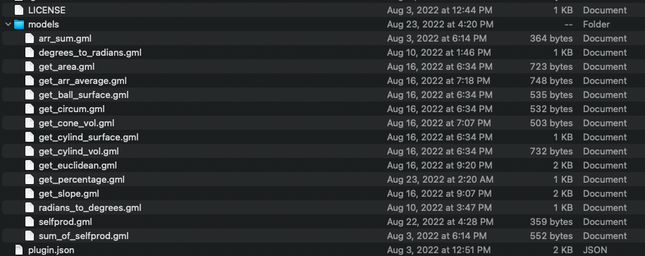
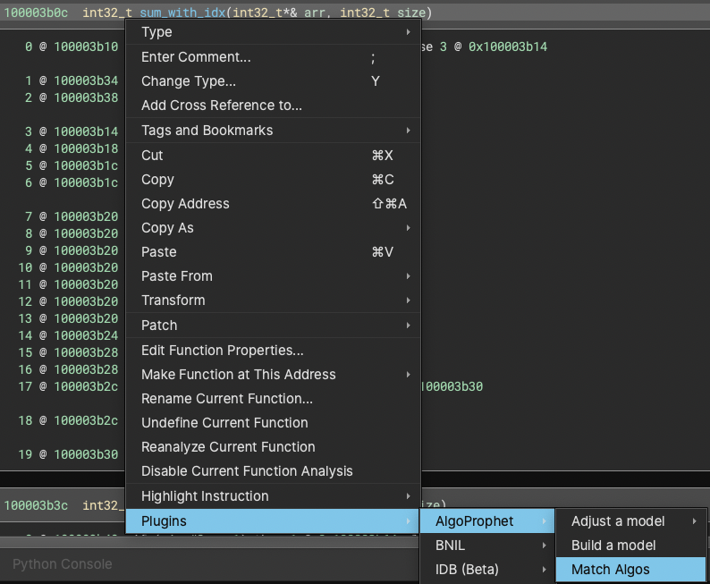
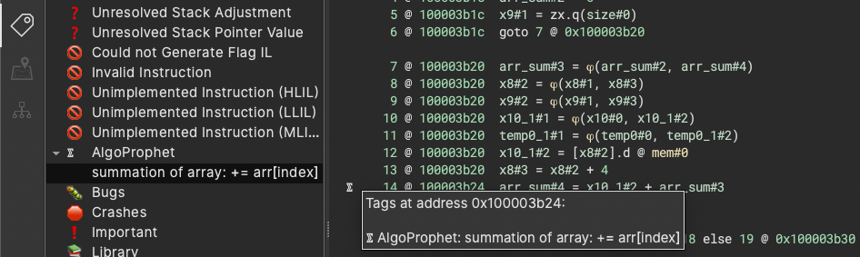
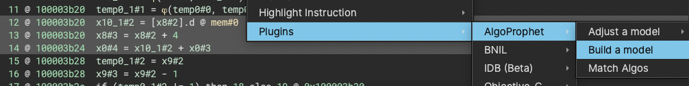
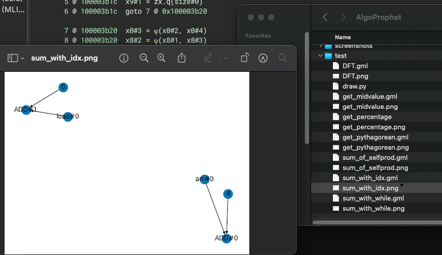
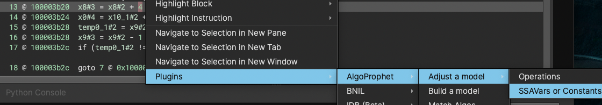
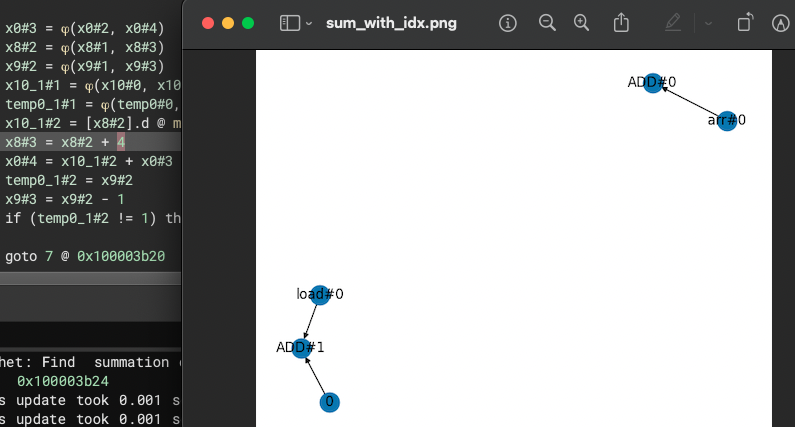
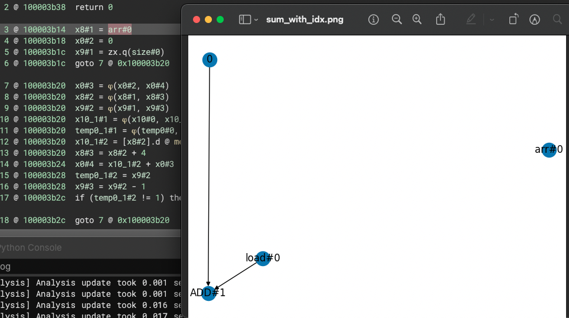

# AlgoProphet
Author: Rafael

The purpose of this project is to identify various, possibly unknown, implementations of known arithmetic algorithms within binaries.

## Description
AlgoProphet builds a model for a given algorithm by generating a high-level data-flow graph (DFG) from its binary code. It uses the DFG model as a pattern for matching against other binary code, in order to identify other, possibly distinct, implementations of the same algorithm. To generate DFGs efficiently, AlgoProphet makes use of the SSA form of Binary Ninja's Medium Level Intermediate Language (MLIL). AlgoProphet uses a number of techniques to improve matching against disparate code, including, among others:

* Arithmetic Normalization: To make the matching algorithm order-independent, AlgoProphet normalizes arithmetic operations. For example, `a - b` (subtraction) is replaced with the semantically equivalent `a + (-1 * b)`.
* Memory Abstraction: Because the specifics of memory usage can vary widely across implementations of an algorithm and architectures, AlgoProphet abstracts the semantics of memory operations and merges them into a load operation to simplify algorithm matching.  


Currently AlgoProphet provides three functionalities through its Binary Ninja plugin:
* Model Matching: Match functions in a binary with existing algorithm models.
* Model Building: Build a model from instructions selected by the user.
* Model Adjustment: Adjust a model by removing irrelevant nodes from the DFG model based on MLIL instruction operands selected by the user.

## Model Matching

The AlgoProphet plugin's `models/` folder contains the existing models in [GML format](https://en.wikipedia.org/wiki/Graph_Modelling_Language): 

**<p align="center" style="text-align: center; width: 75%; margin-left: auto; margin-right: auto">

<br>The `models/` folder of the AlgoPropet's plugin folder</p>**

To match current function with existing models, you can right click anywhere in the function to open the plugin menu, then select `Plugins > AlgoProphet > Match Algos`.

**<p align="center" style="text-align: center; width: 75%; margin-left: auto; margin-right: auto">

<br>Use "Match Algos" in the AlgoProphet plugin menu to run matching</p>**  

For each model that is matched, a tag will be created, indicating which model is likely to be found at the tagged address. In the screenshot, AlgoProphet finds a match for the "summation of array" model at the tagged MLIL instruction:

**<p align="center" style="text-align: center; width: 75%; margin-left: auto; margin-right: auto">

<br>Tagged match results can be found in the AlgoProphet section of the tags list</p>**  

AlgoProphet will also attempt to assign meaningful names to variables, according to matched algorithm. For example, in the screenshot, the variable at line 14 has been changed to `arr_sum`. This helps the user to identify that this variable might be used for the sum of the array.  

We also provide several binary samples of DFT (Discreate Fourier Transform) algorithm with different implementations on Github. Users can download the following samples to test how AlgoProphet identifies and locates DFT from the binaries.  
* [DFT samples on amd64](https://github.com/Vector35/AlgoProphet/blob/main/samples/dft-amd64-linux-O1-test2.bndb)
* [DFT samples on arm64](https://github.com/Vector35/AlgoProphet/blob/main/samples/dft-arm64-linux-O1-simple_names.bndb)

> **Note:** Functions whose names appear in `ignore.txt` will not be considered for matching.

## Model Building

It is possible to expand the algorithms that AlgoProphet can recognize by adding custom models. While it is possible to construct new model GML files by hand, the easiest way to add a model is with the plugin itself. Begin by selecting multiple instructions which you think are important features for the algorithm, and right click to get the plugin menu: `Plugins > AlgoProphet > Build a model`.  

**<p align="center" style="text-align: center; width: 75%; margin-left: auto; margin-right: auto">

<br>Algebra Decompiler sidebar icon</p>**  

You can then find your generated model(`.gml` and visualized graph) in the `test/` subfolder of the plugin folder, named from the function containing the selected instructions:

**<p align="center" style="text-align: center; width: 75%; margin-left: auto; margin-right: auto">

<br>Algebra Decompiler sidebar icon</p>**  

In the screenshot, the newly generated model is `sum_with_idx.gml` and `sum_with_idx.png` is the visualized result.  

Once you have verified that the DFG corresponds to your desired model, you will need to take the following steps before AlgoProphet can use the new model:

* Add a formula entry for the  algorithm into `formula.json`:
```json
{
    ...existing...,
    "[filename].gml": [
        "the rendered algorithm you want to show in tag",
        "the meaningful name to rename variable"
    ]
}
```
Taking `summation of array` model for example, the first element would be `summation of array: += arr[index]` to be shown in tag content; the second element should be the `arr_sum` that would replace target variable with meaningful name:
```json
{
    ...existing...,
    "sum_with_idx.gml": [
        "summation of array: += arr[index]",
        "arr_sum"
    ]
}
```

* move only the `.gml` file (not the `.png` file) from `test/` to `models/`. AlgoProphet will scan any models found in `models/` to match algorithms.

## Model Adjustment

It is hard to build model perfectly at the first time, so we build up an interactive window for users to decide what nodes they want to remove from their models.
> here comes a hint for generating good model: keep it as simple as possible

First, before we adjust a model, make sure that you have existing model put in `test/`. You can also move the model back from `models/`.  
Back to the generated model in previous section, we think that the subgraph which includes `arr#0`, `4`, and `ADD#0` is not important for this algorithm(summation of array).  
To adjust our model, you can right click (at any places of the function) to get the plugin menu: `Plugins > AlgoProphet > Adjust a model`. We can choose to remove either `Operations` or `SSAVars or Constants`.  

**<p align="center" style="text-align: center; width: 75%; margin-left: auto; margin-right: auto">

<br>Use the "Adjust a model" in the AlgoProphet plugin menu to fine-tune a model</p>**  

In screenshot, we pick `SSAVars or Constants` in order to remove `4` from our model.  

**<p align="center" style="text-align: center; width: 75%; margin-left: auto; margin-right: auto">

<br>The adjusted DFG model after removing the operand node for `4`</p>**  

From the screenshot, we can find that `4` is already removed from the graph model. You can also use the same way to remove other `SSAVars`.  
Of course, you can just re-create a new model by highlighting different instructions, but if you want to partial nodes from instructions (e.g., you might want to remove `0` from model, but keep `load#0`), then adjust model would be your best tool!  
Another option is to remove `Operations` such as `load#?` or `ADD#?` from the model. It is invisible to pick from binary view, so we provide an *indirect* way to do it. Assume we want to remove `ADD#0` from the model, and we also know that it is the operator of `arr#0`(from visualized result), we can right-click on `arr#0` and choose the option of `Operations`.

**<p align="center" style="text-align: center; width: 75%; margin-left: auto; margin-right: auto">

<br>The adjusted DFG model after removing the operator node for `ADD#0`</p>**

From the screenshot, we can find that `ADD#0` has been removed from the model. After adjusting your model, remember to put it back to `models/` before `Match Algos`, also keep the information in `formula.json` and your model consistent.

> Suggest to keep test folder clean after you move your own model

## Limitations and Future work
AlgoProphet is the prototype of the concept: using data-flow graph to identify different implementation of arithmetic algorithm. Currently, AlgoProphet requires human's effort to generate models manually on Binary View. However, based on the matching results of AlgoProphet, we are convinced that AlgoProphet can help people to identify algorithms from the binaries. What's more, in addition to the known arithmetic algorithm, AlgoProphet also allows users to define models for their own implemented algorithms! In next step, we are exploring the way to help users generate models automatically or human-in-the-loop by machine learning work(e.g., GNN based on our generated graph models).  

In future work, AlgoProphet will not only focus on completeness of **intraprocedural** data flow analysis as near-term, but also extend the work to **interprocedural** data flow analysis as longer-term so that we can define the behaviors of callee(e.g., semantic summary extraction based on Infer).

## License
This plugin is released under an [MIT license](./license).
